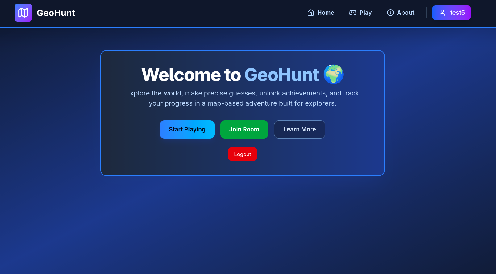
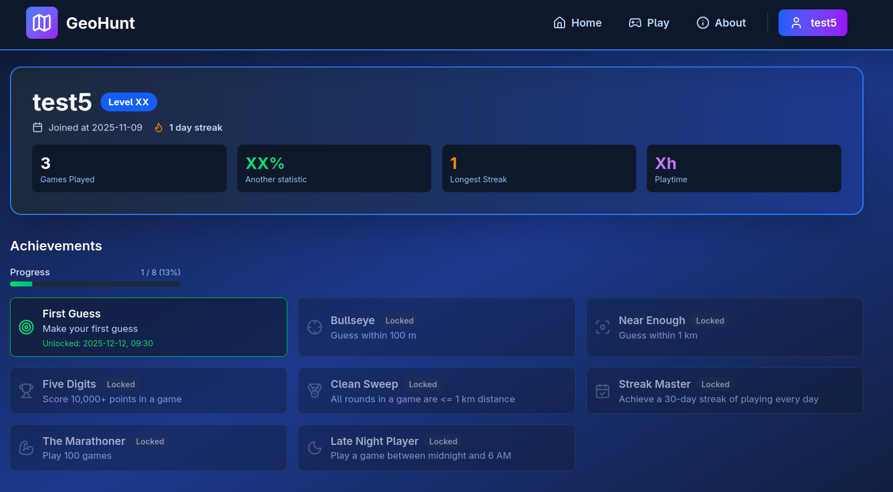
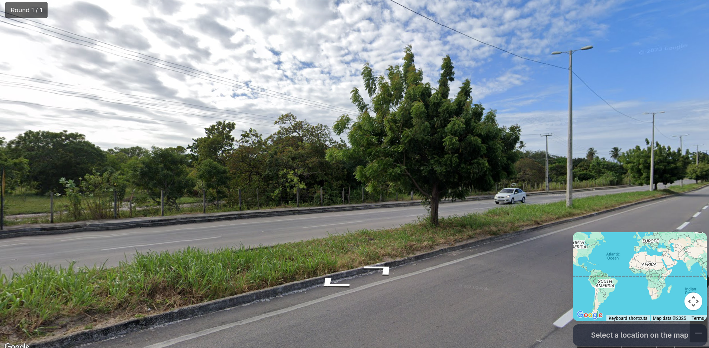
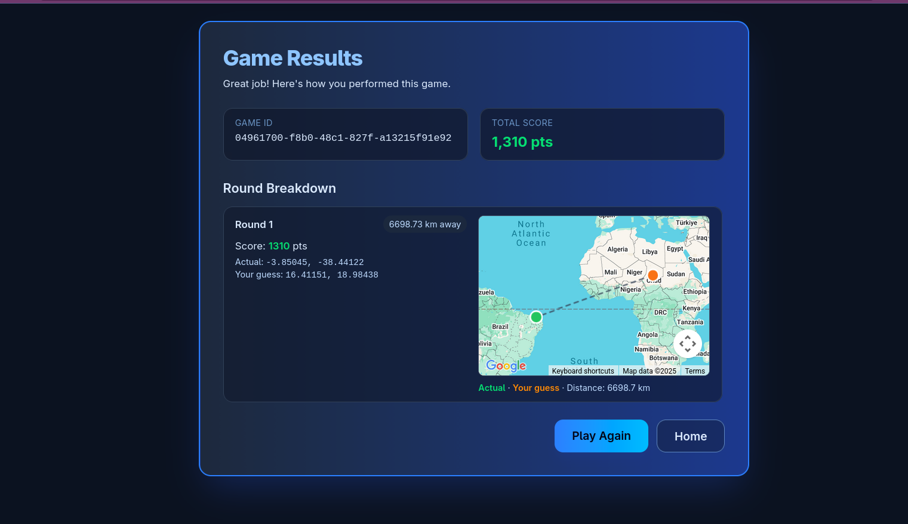
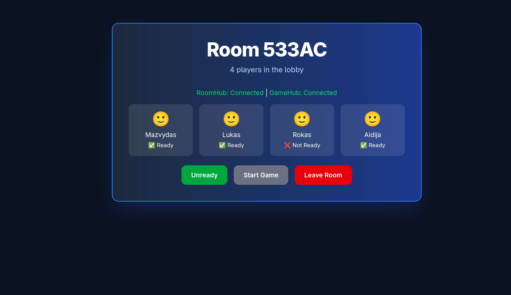

# GEOHUNT

This is a second-year software engineering students project with goals to learn of developing a software and build an apllication which will be fun to use. Welcome to GEOHUNT!

This is a web-based geography guessing game inspired by GeoGuessr, built with **.NET** and **React**.

Players are dropped into a random location and must guess where they are on the map using visual clues from their surroundings.

## 🎮 About the Game

The game drops players into random locations around the world using Google Street View imagery. Players can navigate the streets and explore their surroundings to gather clues about their location. Once they feel confident, they make a guess on the map, and the game reveals how close they were to the actual location.

Key features include:
  * [x] Single-player mode: Play solo and try to beat your high score.
  * [x] Multiplayer mode: Challenge friends or random players in real-time matches by joining rooms.
  * [x] Rooms: Create or join rooms to play with friends.
  * [x] Achievements: Earn achievements for reaching milestones.
  * [x] Player profiles: Track your stats and progress over time.

## 📸 Screenshots
  *The main menu where you can start a game, join rooms.*
  

  *Player Stats and Profile Page.*
  

  *Game in action - guessing location using Street View.*
  

  *Results screen showing distance from actual location.*
  

  *Room Lobby for multiplayer games.*
  


## 🛠 Tech Stack

This section describes the project's technology choices, architecture.

Backend
- Framework: ASP.NET Core (TargetFramework: net9.0)
- Project: `psi25-project/psi25-project.csproj`
- Key libraries:
	- Entity Framework Core + Npgsql for PostgreSQL (EF Core migrations live in `psi25-project/Migrations`).
	- ASP.NET Core Identity with EntityFramework store for authentication.
	- SignalR for real-time multiplayer/room updates.
	- Serilog for structured logging (file sink configured).
	- Swashbuckle (Swagger) for API documentation / OpenAPI.
	- Polly + Microsoft.Extensions.Http.Polly for resilient HTTP calls.

Database & Migrations
- The app uses EF Core migrations; several migrations are included in `psi25-project/Migrations`.
- The project targets PostgreSQL via `Npgsql.EntityFrameworkCore.PostgreSQL`.
- Migrations are applied at runtime (see logs and migration history in project logs).

Frontend
- There's a `frontend/` folder (React) for the client UI. The README doesn't contain the frontend manifest here but the repo contains a `frontend` directory.

Testing
- Unit and integration tests live in `Geohunt.Tests` and use xUnit, Moq, FluentAssertions, and Microsoft.AspNetCore.Mvc.Testing for integration testing.
- Code coverage tooling: coverlet collector is referenced in the tests project.

## Prerequisites

- .NET 9 SDK installed (the backend targets net9.0; adjust if your local SDK differs).
- Node.js 18+ and npm (used for the React frontend and Vite).
- Docker (optional) to run a local PostgreSQL instance quickly.

## Packages used (quick reference)

Backend (NuGet packages found in `psi25-project/psi25-project.csproj`)
- Microsoft.AspNetCore.Identity
- Microsoft.AspNetCore.Identity.EntityFrameworkCore
- Microsoft.AspNetCore.OpenApi
- Microsoft.AspNetCore.SignalR
- Microsoft.EntityFrameworkCore
- Microsoft.EntityFrameworkCore.Design
- Microsoft.EntityFrameworkCore.Tools
- Microsoft.Extensions.Http.Polly
- Npgsql.EntityFrameworkCore.PostgreSQL
- Polly.Extensions.Http
- Serilog.AspNetCore
- Serilog.Sinks.File
- Swashbuckle.AspNetCore

Frontend (from `frontend/package.json`)
- Runtime dependencies: `react`, `react-dom`, `react-router-dom`, `@microsoft/signalr`, `@googlemaps/js-api-loader`, `lucide-react`
- Dev dependencies: `vite`, `typescript`, `@vitejs/plugin-react`, `tailwindcss`, `postcss`, `eslint` and supporting plugins/types

## Install & run (local development)

1) Backend: restore, build & run

```bash
# from repository root
dotnet restore psi25-project/psi25-project.csproj
dotnet build psi25-project/psi25-project.csproj
dotnet run psi25-project/psi25-project.csproj
```

2) Frontend: install & start (Vite)

```bash
cd frontend
npm install
npm run dev
```

3) Apply EF Core migrations (requires dotnet-ef)

```bash
dotnet tool install --global dotnet-ef 
dotnet ef database update --project psi25-project/psi25-project.csproj --startup-project psi25-project/psi25-project.csproj
```

4) Run tests

```bash
dotnet test Geohunt.Tests/Geohunt.Tests.csproj
```

Notes
- The backend uses user secrets (UserSecretsId is present) and appsettings files for configuration. Set your DB connection string and API keys via environment variables or user secrets during local development.
- If you prefer `pnpm` or `yarn`, substitute `npm install` with your package manager of choice inside the `frontend/` folder.

## 🤝 Contributing
This project was build by second-year software engineering students as part of their curriculum. Contributions are not being accepted at this time.

By:
- Lukas Zujevas https://github.com/futuristaz
- Mažvydas Peleckas https://github.com/mazvydiekas
- Rokas Sirvydis https://github.com/R0ckguy
- Aidija Rubliauskaitė https://github.com/aidijarub

